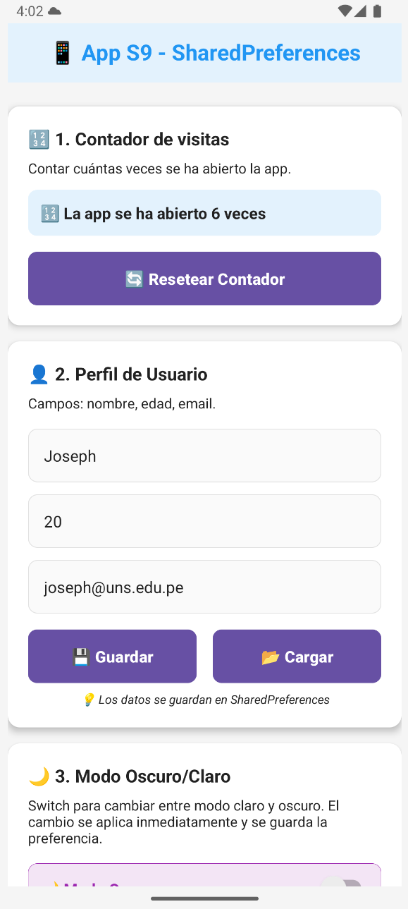
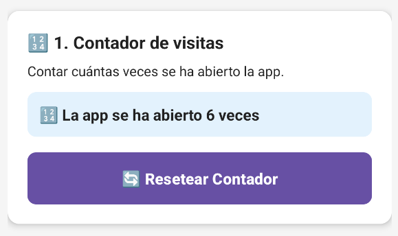
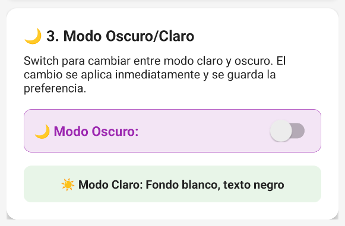
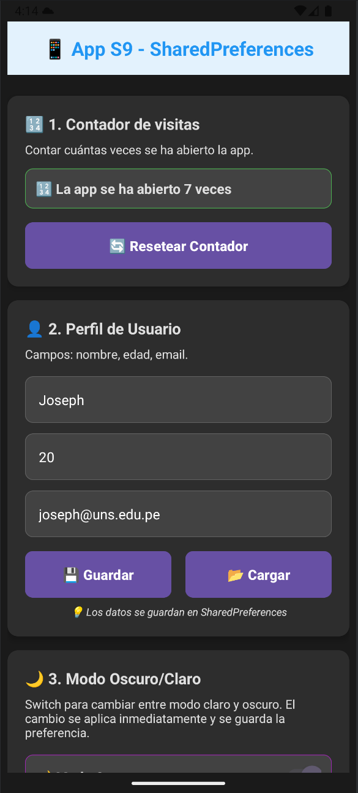

# 📱 App S9 - SharedPreferences

## 📖 Descripción

**App S9** es una aplicación móvil desarrollada en Android que demuestra el uso completo de **SharedPreferences** para almacenamiento persistente de datos. La aplicación implementa **Material Design** moderno con sistema de modo oscuro/claro dinámico.

## 🎯 Objetivos - Semana 09

- **Contador de Visitas:** Sistema automático de conteo con SharedPreferences
- **Perfil de Usuario:** Gestión de datos personales con persistencia
- **Modo Oscuro/Claro:** Tema dinámico con cambio en tiempo real

---

## ✨ Características Principales

### 🔢 Contador de Visitas
- ✅ **Conteo automático** de aperturas de la app
- 🔄 **Botón de reseteo** para reiniciar contador
- 💾 **Persistencia** entre sesiones con SharedPreferences

### 👤 Perfil de Usuario
- 📝 **Campos:** nombre, edad, email
- 💾 **Botones:** guardar y cargar datos
- ✅ **Validaciones** robustas de entrada
- 🔄 **Persistencia** completa de datos

### 🌙 Modo Oscuro/Claro
- 🌓 **Switch dinámico** para cambiar tema
- ⚡ **Cambio en tiempo real** sin reiniciar
- 💾 **Persistencia** de preferencia de tema
- 🎨 **Colores optimizados** para ambos modos

---

## 📸 Capturas de Pantalla

### Modo Claro


*Interfaz principal en modo claro con todas las funcionalidades*

### Contador de Visitas


*Sistema de conteo automático de aperturas de la app*

### Perfil de Usuario


*Formulario completo con validaciones para datos personales*

### Switch Modo Oscuro


*Control dinámico para cambio de tema en tiempo real*

### Modo Oscuro


*Tema oscuro con excelente contraste y legibilidad*

---

## 📋 Cumplimiento de Requisitos

### ✅ 1. Contador de Visitas (Con SharedPreferences)
- [x] **Contar cuántas veces se ha abierto la app**
- [x] **Botón para resetear el contador**

```kotlin
// Implementación del contador
val currentCount = sharedPreferencesHelper.getInt(KEY_VISIT_COUNT, 0)
val newCount = currentCount + 1
sharedPreferencesHelper.saveInt(KEY_VISIT_COUNT, newCount)
```

### ✅ 2. Perfil de Usuario
- [x] **Campos:** nombre, edad, email
- [x] **Botón guardar y cargar**
- [x] **Guardar datos en SharedPreferences**

```kotlin
// Guardar perfil
sharedPreferencesHelper.saveString(KEY_USER_NAME, name)
sharedPreferencesHelper.saveInt(KEY_USER_AGE, age)
sharedPreferencesHelper.saveString(KEY_USER_EMAIL, email)
```

### ✅ 3. Modo Oscuro/Claro
- [x] **Switch con texto "Modo Oscuro"**
- [x] **Cambiar preferencia inmediatamente**
- [x] **Tema cambia en tiempo real**
- [x] **Modo Claro:** Fondo blanco, texto negro
- [x] **Modo Oscuro:** Fondo gris con texto blanco

```kotlin
// Toggle dinámico
switchDarkMode.setOnCheckedChangeListener { _, isChecked ->
    sharedPreferencesHelper.saveBoolean(KEY_DARK_MODE, isChecked)
    applyTheme(isChecked)
}
```

---

## 🔧 Tecnologías y Componentes Utilizados

### 💾 SharedPreferences - Claves Implementadas
- **KEY_VISIT_COUNT** - Contador de visitas
- **KEY_USER_NAME** - Nombre del usuario
- **KEY_USER_AGE** - Edad del usuario  
- **KEY_USER_EMAIL** - Email del usuario
- **KEY_DARK_MODE** - Preferencia de tema

### 🎨 Material Design Moderno
- **CardView** - Tarjetas organizadas con elevación
- **EditText** - Campos con styling dinámico
- **Switch** - Control de modo oscuro/claro
- **Button** - Botones con colores adaptativos
- **ScrollView** - Diseño responsive

### ⚙️ Validaciones Implementadas
- **Campos obligatorios** - Validación de entrada
- **Edad válida** - Rango 1-150 años
- **Persistencia robusta** - Datos seguros entre sesiones

---

## 🚀 Cómo Probar

### 🔢 Contador de Visitas
1. Abrir la app → Contador incrementa automáticamente
2. Cerrar app completamente → Reabrir → Contador persiste
3. Presionar "Resetear" → Contador vuelve a 0

### 👤 Perfil de Usuario
1. Llenar campos: "Joseph", "20", "joseph@uns.edu.pe"
2. Presionar "Guardar" → Mensaje de éxito
3. Presionar "Cargar" → Datos se recuperan
4. Cerrar/abrir app → Datos persisten

### 🌙 Modo Oscuro/Claro
1. Activar switch → Cambio inmediato a modo oscuro
2. Verificar colores: fondo gris, texto blanco
3. Cerrar/abrir app → Preferencia se mantiene
4. Desactivar switch → Regreso a modo claro

---

## 👨‍💻 Autor

**Dueñas Blas, Joseph**
- 🎓 Universidad Nacional del Santa